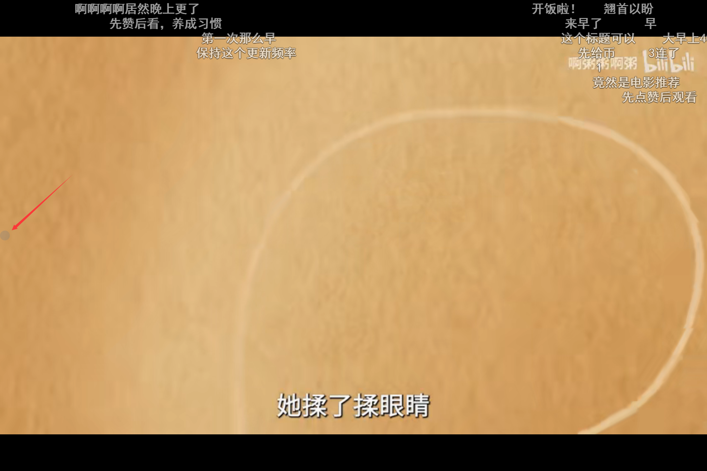

# 油猴脚本：视频播放锁屏工具（Tampermonkey Script: Video Player Lock Tool）

## Language / 语言
- [English](#english)
- [中文](#chinese)

## English 
This Tampermonkey script aims to provide a convenient lock button for browser video playback in fullscreen mode, effectively preventing accidental screen touches and ensuring an uninterrupted viewing experience. It's particularly useful for users watching videos on Windows tablets.

### 1.1 Features
- Display a gray circular lock button on the left side of the interface during browser video fullscreen playback.
- Clicking the button will lock the screen, preventing accidental clicks that may disrupt video playback; the button turns green.
- Click the button again to unlock the screen and restore touch functionality.
- The button automatically hides when exiting fullscreen video mode.

### 1.2 Supported Websites
- Youku (youku.com)
- iQiyi (iqiyi.com)
- iQiyi International (iq.com)
- Tencent Video (v.qq.com)
- Tencent Video Mobile Version (m.v.qq.com)
- Tudou (tudou.com)
- YouTube (youtube.com)
- Bilibili (bilibili.com)

### 1.3 Installation instructions
- Install the Tampermonkey browser extension (if not already installed).
- Click [here](https://greasyfork.org/zh-CN/scripts/474012-screen-lock-key-%E8%A7%86%E9%A2%91%E6%92%AD%E6%94%BE%E9%94%81%E5%B1%8F%E5%B7%A5%E5%85%B7) to install the Tampermonkey script.
- Visit any website that supports fullscreen video playback and start using the lock feature.

### 1.4 Usage guide
- When in full-screen mode, a gray circular button will appear on the left side.
  
- After clicking the button, it will turn green. At this point, the screen becomes locked. To unlock, please click the button again.
  

### 1.5 Contributions
Contributions and feedback are welcome! Please use GitHub Issues and Pull Requests for contributions.

## 中文 
这款油猴脚本旨在为浏览器视频全屏播放时提供方便的锁屏按键，有效防止误触屏幕，提供持续的无干扰观看体验。特别适用于使用Windows平板观看视频的用户。

### 2.1 特性
- 在浏览器视频全屏播放时，在界面左侧显示一个灰色圆形锁定屏幕按钮。
- 点击按钮将锁定屏幕，防止点击干扰视频播放，按钮变为绿色。
- 再次点击按钮解锁屏幕，恢复点击功能。
- 在退出视频全屏模式时，按钮自动隐藏。

### 2.2 支持的网站
- 优酷网（youku.com）
- 爱奇艺（iqiyi.com）
- 爱奇艺国际版（iq.com）
- 腾讯视频（v.qq.com）
- 腾讯视频移动版（m.v.qq.com）
- 土豆网（tudou.com）
- YouTube（youtube.com）
- 哔哩哔哩（bilibili.com）
  

### 2.3 安装指南
- 安装油猴浏览器插件（如果尚未安装）。
- 点击[此处](https://greasyfork.org/zh-CN/scripts/474012-screen-lock-key-%E8%A7%86%E9%A2%91%E6%92%AD%E6%94%BE%E9%94%81%E5%B1%8F%E5%B7%A5%E5%85%B7)安装油猴脚本。
- 进入任意支持全屏视频播放的网站，开始使用锁屏功能。

### 2.4 使用说明
- 在视频全屏的时候，左方会出现一个灰色的圆形按钮。

- 点击该按钮后，该按键变成绿色。此时视频被锁定。需要解锁请重新点击该按键。

### 2.5 贡献
欢迎贡献代码和提供反馈！请通过GitHub的Issue和Pull Request进行。
  
